<div align="right">
  <a href="./README.md">Português</a> &nbsp;•&nbsp; <b>English</b>
</div>

<div align="center">



</div>

<div align="center">


</div>

<div align="center">

[](#technologies-used)
[](#technologies-used)
[](#tests-and-build)
[](https://logo-qr-code-generator-tool.vercel.app/)

</div>

---

**Logo QR Code Generator** is a client-side SPA for creating corporate QR Codes with centered SVG logos, brand colors, scannability checks, and cards ready for digital or printed use. Everything runs in the browser: there is no backend, login, database, or required data transfer to external servers.

<div align="center">

<table>
  <tr>
    <td align="center" valign="middle" width="80">
      
    </td>
    <td>
      <strong>Logo QR Code Generator</strong><br/>
      <small>Branded QR Codes, safe SVG handling, real-time preview, and high-quality exports.</small><br/>
      <a href="https://logo-qr-code-generator-tool.vercel.app/" target="_blank">
        
      </a>
    </td>
  </tr>
</table>

</div>

---

## Table of Contents

1. [MVP Status](#mvp-status)
2. [The Problem](#the-problem)
3. [The Solution](#the-solution)
4. [Examples](#examples)
5. [Delivered Features](#delivered-features)
6. [Security and Privacy](#security-and-privacy)
7. [Technologies Used](#technologies-used)
8. [Running Locally](#running-locally)
9. [Tests and Build](#tests-and-build)
10. [Project Structure](#project-structure)
11. [Post-MVP Roadmap](#post-mvp-roadmap)

---

## MVP Status

| Item | State |
| --- | --- |
| MVP | Completed |
| Documentation closure | 2026-08-13 |
| Deploy | https://logo-qr-code-generator-tool.vercel.app/ |
| Architecture | Single-route, fully client-side SPA |
| Exports | Standalone QR as SVG/PNG and complete card as PNG |
| Automated validation | Vitest for SVG sanitization and normalization |

## The Problem

Traditional QR Codes work, but they often clash with brand identity. Free generators can also include ads, lock high-quality exports behind subscriptions, or produce raster images that lose definition in print.

## The Solution

The project delivers a fast, local, open tool for generating branded QR Codes:

- **Consistent branding:** configurable SVG logo, QR modules, eyes, background, and text colors.
- **Reliable preview:** real-time card updates with text above or below the QR Code.
- **Useful exports:** QR downloads as SVG/PNG and complete card downloads as PNG.
- **Protected readability:** export warnings and blocking when contrast falls below the minimum.
- **Real privacy:** all processing happens in the user's browser.

## Examples

<div align="center">

| Logo QR Code Generator | Subscription Lifecycle Supervisor | Price Simulator |
| :---: | :---: | :---: |
| <a href="https://logo-qr-code-generator-tool.vercel.app/" target="_blank"></a> | <a href="https://logo-qr-code-generator-tool.vercel.app/" target="_blank"></a> | <a href="https://logo-qr-code-generator-tool.vercel.app/" target="_blank"></a> |

</div>

## Delivered Features

- Form with URL, company name, title, description, text position, logo scale, and color controls.
- Real-time validation with Zod and field-level messages.
- Automatic link type detection: website, WhatsApp, Instagram, Facebook, Google Maps, Google Forms, and menu.
- Suggested color theme per link type, while preserving manual overrides per field.
- SVG upload with allowlist sanitization, 500 KB size limit, remote vector blocking, and `viewBox` normalization.
- Real QR Code rendering with `qr-code-styling`, high error correction, rounded modules, and centered logo support.
- Contrast-based scannability states: safe, acceptable, or blocked.
- Standalone QR export as SVG and PNG.
- Complete card export as high-resolution PNG with `pixelRatio` 2.
- Light/dark mode, favicon, header logo, and bilingual banners.
- UI split into focused components, hooks, and CSS files by responsibility.
- Basic accessibility with labels, ARIA descriptions, visible focus, and export status feedback.

## Security and Privacy

- No data is sent to a custom backend or required external API.
- User-provided SVGs are sanitized before entering the preview.
- Unknown tags and attributes, inline events, external references, and dangerous CSS are removed or blocked.
- SVG files larger than 500 KB are rejected before parsing to reduce preview-freeze risk.
- Downloads are blocked when QR/background contrast is below `3.0:1`.

## Technologies Used

- React 18 with modern JavaScript.
- Vite 5 for development, build, and preview.
- Native CSS modularized under `src/styles/`.
- Zod for configuration validation.
- `qr-code-styling` for QR Code rendering and export.
- `html-to-image` for complete card capture as PNG.
- Vitest + jsdom for SVG sanitization, size-limit, and normalization tests.

## Running Locally

```bash
npm install
npm run dev
```

To preview the production build locally:

```bash
npm run preview
```

## Tests and Build

```bash
npm run test
npm run build
```

## Project Structure

```text
logo-qr-code-generator/
  assets/
    banner-animated.svg
    banner-animated.en.svg
    examples/
  public/
    favicon.svg
  src/
    components/
      controls/
      preview/
    hooks/
    lib/
      cardExport.js
      contrast.js
      formUtils.js
      linkDetection.js
      qr.js
      svg.js
      svg.test.js
      themeColors.js
    styles/
      base.css
      forms.css
      global.css
      preview.css
      responsive.css
      shell.css
      theme-dark.css
    App.jsx
    main.jsx
    types.js
  index.html
  package.json
  package-lock.json
  README.md
  README.en.md
  vite.config.js
```

## Post-MVP Roadmap

- Pix payload generation.
- Dynamic palette extraction from predominant SVG colors.
- Physical templates for tabletop displays.
- Controlled PNG/JPG logo support.

---

<div align="center">
Developed by <b>Pedro Labre</b>
</div>
