<div align="right">
  <b>Português</b> &nbsp;•&nbsp; <a href="./README.en.md">English</a>
</div>

<div align="center">



</div>

<div align="center">


</div>

<div align="center">

[](#tecnologias-usadas)
[](#tecnologias-usadas)
[](#testes-e-build)
[](https://logo-qr-code-generator-tool.vercel.app/)

</div>

---

**Logo QR Code Generator** é uma SPA client-side para gerar QR Codes corporativos com logo SVG centralizado, cores de marca, validação de escaneabilidade e cards prontos para uso digital ou impresso. Tudo roda no navegador: não há backend, login, banco de dados ou envio obrigatório de dados para servidores externos.

<div align="center">

<table>
  <tr>
    <td align="center" valign="middle" width="80">
      
    </td>
    <td>
      <strong>Logo QR Code Generator</strong><br/>
      <small>QR Codes com branding, SVG seguro, preview em tempo real e exportação em alta qualidade.</small><br/>
      <a href="https://logo-qr-code-generator-tool.vercel.app/" target="_blank">
        
      </a>
    </td>
  </tr>
</table>

</div>

---

## Índice

1. [Status do MVP](#status-do-mvp)
2. [O Problema](#o-problema)
3. [A Solução](#a-solução)
4. [Exemplos](#exemplos)
5. [Funcionalidades Entregues](#funcionalidades-entregues)
6. [Segurança e Privacidade](#segurança-e-privacidade)
7. [Tecnologias Usadas](#tecnologias-usadas)
8. [Como Executar Localmente](#como-executar-localmente)
9. [Testes e Build](#testes-e-build)
10. [Estrutura do Projeto](#estrutura-do-projeto)
11. [Roadmap Pós-MVP](#roadmap-pós-mvp)

---

## Status do MVP

| Item | Estado |
| --- | --- |
| MVP | Concluído |
| Fechamento documental | 2026-08-13 |
| Deploy | https://logo-qr-code-generator-tool.vercel.app/ |
| Arquitetura | SPA de rota única, 100% client-side |
| Exportações | QR puro em SVG/PNG e card completo em PNG |
| Validação automatizada | Vitest para sanitização e normalização de SVG |

## O Problema

QR Codes tradicionais funcionam, mas costumam quebrar a identidade visual da marca. Geradores gratuitos também podem trazer anúncios, limitar exportações de qualidade ou entregar imagens rasterizadas que perdem definição em materiais impressos.

## A Solução

O projeto entrega uma ferramenta aberta, rápida e local para gerar QR Codes com branding:

- **Branding consistente:** logo SVG, cores do QR, olhos, fundo e texto configuráveis.
- **Preview confiável:** card atualizado em tempo real com texto acima ou abaixo do QR.
- **Exportação útil:** downloads do QR em SVG/PNG e do card completo em PNG.
- **Leitura protegida:** alerta e bloqueio de exportação quando o contraste fica abaixo do mínimo.
- **Privacidade real:** todo o processamento acontece no navegador do usuário.

## Exemplos

<div align="center">

| Logo QR Code Generator | Subscription Lifecycle Supervisor | Price Simulator |
| :---: | :---: | :---: |
| <a href="https://logo-qr-code-generator-tool.vercel.app/" target="_blank"></a> | <a href="https://logo-qr-code-generator-tool.vercel.app/" target="_blank"></a> | <a href="https://logo-qr-code-generator-tool.vercel.app/" target="_blank"></a> |

</div>

## Funcionalidades Entregues

- Formulário com URL, nome da empresa, título, descrição, posição do texto, escala do logo e controles de cor.
- Validação em tempo real com Zod e mensagens próximas aos campos.
- Detecção automática de tipo de link: website, WhatsApp, Instagram, Facebook, Google Maps, Google Forms e menu/cardápio.
- Tema de cores sugerido por tipo de link, com sobrescrita manual preservada por campo.
- Upload de SVG com sanitização por allowlist, limite de 500 KB, remoção de vetores remotos e normalização de `viewBox`.
- QR Code real renderizado com `qr-code-styling`, correção de erro alta, módulos arredondados e logo central.
- Status de escaneabilidade por contraste: leitura segura, aceitável ou comprometida.
- Exportação do QR puro em SVG e PNG.
- Exportação do card completo em PNG de alta resolução com `pixelRatio` 2.
- Modo claro/escuro, favicon, logo no cabeçalho e banners bilíngues.
- Interface modularizada em componentes, hooks e folhas CSS por responsabilidade.
- Acessibilidade básica com labels, descrições ARIA, foco visível e status de exportação.

## Segurança e Privacidade

- Nenhum dado é enviado para backend próprio ou API externa obrigatória.
- SVGs enviados pelo usuário passam por sanitização antes de entrar no preview.
- Tags, atributos desconhecidos, eventos inline, referências externas e CSS perigoso são removidos ou bloqueados.
- Arquivos SVG acima de 500 KB são recusados antes do parse para reduzir risco de travamento.
- Downloads são bloqueados quando o contraste entre QR e fundo fica abaixo de `3.0:1`.

## Tecnologias Usadas

- React 18 com JavaScript moderno.
- Vite 5 para desenvolvimento, build e preview.
- CSS nativo modularizado em `src/styles/`.
- Zod para validação de configuração.
- `qr-code-styling` para renderização e exportação do QR Code.
- `html-to-image` para captura do card completo em PNG.
- Vitest + jsdom para testes de sanitização, limite de tamanho e normalização de SVG.

## Como Executar Localmente

```bash
npm install
npm run dev
```

Para visualizar a build localmente:

```bash
npm run preview
```

## Testes e Build

```bash
npm run test
npm run build
```

## Estrutura do Projeto

```text
logo-qr-code-generator/
  assets/
    banner-animated.svg
    banner-animated.en.svg
    examples/
  public/
    favicon.svg
  src/
    components/
      controls/
      preview/
    hooks/
    lib/
      cardExport.js
      contrast.js
      formUtils.js
      linkDetection.js
      qr.js
      svg.js
      svg.test.js
      themeColors.js
    styles/
      base.css
      forms.css
      global.css
      preview.css
      responsive.css
      shell.css
      theme-dark.css
    App.jsx
    main.jsx
    types.js
  index.html
  package.json
  package-lock.json
  README.md
  README.en.md
  vite.config.js
```

## Roadmap Pós-MVP

- Geração de payload Pix.
- Paleta dinâmica baseada nas cores predominantes do SVG.
- Templates físicos para displays de mesa.
- Suporte controlado a logos PNG/JPG.

---

<div align="center">
Desenvolvido por <b>Pedro Labre</b>
</div>
